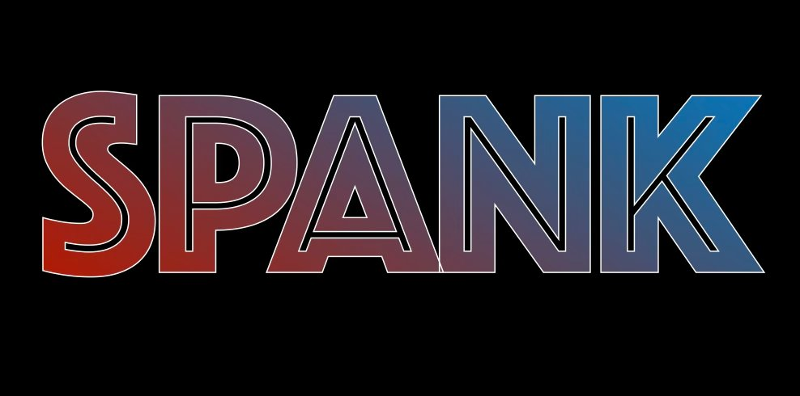

# spank-for-windows



[![Latest release][badge-release]][releases-latest]
[![MIT License][badge-license]][license-link]
![Go version 1.21+][badge-go]

Slap your laptop, it yells back.

spank-for-windows is a Windows-native derivative of the original spank project,
with a desktop UI built using Go and Fyne.

Inspired by: [taigrr/spank][upstream]

## What this app does

- Listens for short impact-like audio spikes.
- Detects slap events using amplitude and spike-ratio logic.
- Plays audio responses in one of three modes:
  - Pain
  - Sexy (escalates based on recent slap count)
  - Halo
- Gives you a simple GUI with Start/Stop controls, mode switching, and a
  sensitivity slider.

## Quick start (recommended for beginners)

If you only want to use the app:

1. Open the latest release page: [Latest Release][releases-latest]
2. Download spank.exe.
3. Run spank.exe.
4. Click START in the app.
5. Pick a mode (Pain, Sexy, or Halo) and test with light taps first.

## Install on a new PC

For normal use, you only need the EXE file.

Latest Release: [Download here][releases-latest]

1. Open the latest release page.
2. Download spank.exe.
3. Move it to any folder you like (for example, Desktop or Program Files).
4. Double-click spank.exe to run.

If Windows SmartScreen appears:

1. Click More info.
2. Click Run anyway.

When do you need source code and build.bat?

- Only if you want to modify the project.
- Only if you want to build the app yourself.
- Only if you want the script-driven setup flow from build.bat.
- You do not need source code to install and run the released EXE.

## Build from source (Windows)

### Requirements

- Windows 10 or newer
- Go 1.21+
- GCC (MinGW-w64)
- Git

Optional:

- windres (for embedding icon resources during build)

### Option 1: Automated build and install

Run:

```bat
build.bat
```

This script will:

- Verify required tools (gcc, go, git)
- Pull audio files from upstream spank
- Build spank.exe
- Install to %LOCALAPPDATA%\Spank
- Create Desktop and Start Menu shortcuts

### Option 2: Manual build

```bash
go mod tidy
go build -ldflags="-s -w -H windowsgui" -o spank.exe .
```

Then run:

```powershell
.\spank.exe
```

## How to use

1. Open the app.
2. Select mode:
   - Pain: random pain/protest clips
   - Sexy: escalating clips based on activity in the last 5 minutes
   - Halo: random Halo-style death sounds
3. Click START.
4. Adjust sensitivity with the slider if it is too sensitive or not sensitive enough.
5. Click STOP when done.

## Sensitivity tips

- If sounds trigger too often:
  - Lower sensitivity using the slider.
  - Reduce background noise around your mic/input device.
- If it misses slaps:
  - Raise sensitivity gradually.
  - Test with clear, short taps.

## Troubleshooting

### App opens but never detects slaps

- Check your Windows audio input devices.
- Try changing the default input device in Windows sound settings.
- Increase sensitivity in the app.

### Build fails with "gcc not found"

- Install MinGW-w64.
- Add its bin folder to your PATH.
- Reopen terminal and run build again.

### No audio playback

- Confirm your output device is working.
- Confirm audio assets are present under audio/pain, audio/sexy, and audio/halo.

## Project structure

- main.go: GUI, runtime engine, mode handling, playback orchestration
- sensor/sensor_windows.go: Windows audio sampling (WASAPI/COM)
- detector/detector.go: slap detection logic
- audio/: response audio assets
- build.bat: installer-oriented build helper script

## Attribution and license

This repository is licensed under MIT.

Final release note:

- This final release is vibecoded with Claude assistance.
- Thanks to Anthropic and Claude for helping accelerate iteration.

- Original work: taigrr (spank)
- Derivative Windows implementation: spank-for-windows contributors

See LICENSE for the full license text and attribution terms.

## Disclaimer

This is an independent derivative work and is not affiliated with the original project maintainers.


[badge-release]: https://img.shields.io/github/v/release/mithun-srinivasan/spank-for-windows?label=release
[badge-license]: https://img.shields.io/github/license/mithun-srinivasan/spank-for-windows
[badge-go]: https://img.shields.io/badge/Go-1.21%2B-00ADD8?logo=go
[releases-latest]: https://github.com/mithun-srinivasan/spank-for-windows/releases/latest
[license-link]: https://github.com/mithun-srinivasan/spank-for-windows/blob/main/LICENSE
[upstream]: https://github.com/taigrr/spank
